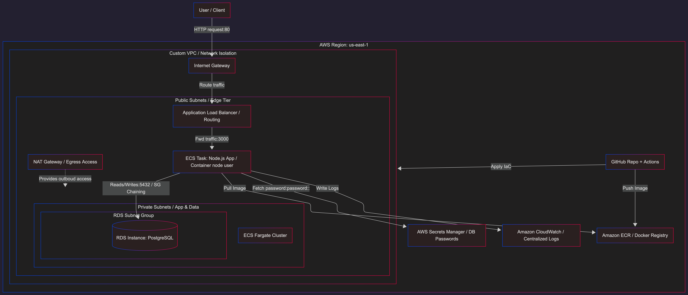

# AWS Cloud Infrastructure & CI/CD Pipeline


## 📌 Overview
This repository contains the complete Infrastructure as Code (IaC) and CI/CD configuration required to deploy a modern, scalable, and secure web application on Amazon Web Services (AWS). It demonstrates core Site Reliability Engineering (SRE) and DevOps principles, including immutable infrastructure, zero-downtime deployments, and least-privilege security.

## 🏗️ Architecture


The infrastructure is provisioned using **Terraform** and follows a modular design. Key components include:
* **Networking:** A custom VPC with public subnets (for the Load Balancer) and private subnets (for the application and database), managed via NAT Gateways.
* **Compute:** Amazon ECS running on AWS Fargate (Serverless compute for containers).
* **Routing:** Application Load Balancer (ALB) distributing traffic to healthy ECS tasks across multiple Availability Zones.
* **Database:** Amazon RDS (PostgreSQL) deployed in a private subnet.
* **Storage & Secrets:** Amazon ECR for Docker images and AWS Secrets Manager for secure database credential injection.
* **Observability:** Centralized logging using Amazon CloudWatch.

## 🔒 Security & SRE Best Practices Implemented
* **Security Group Chaining:** The RDS database only accepts traffic explicitly coming from the ECS tasks' Security Group.
* **Least Privilege IAM:** Custom IAM roles are strictly scoped for ECS task execution, reading specific secrets, and writing to CloudWatch.
* **Secret Management:** Database passwords are dynamically generated, stored in AWS Secrets Manager, and injected into the containers at runtime (never hardcoded).
* **Multi-Stage Docker Builds:** Optimized, lightweight Alpine-based container images running as a non-root `node` user to prevent privilege escalation.
* **GitOps CI/CD:** Infrastructure and application deployments are fully automated and triggered exclusively via Pull Requests to `develop` and `main` branches.

## 🚀 CI/CD Pipeline (GitHub Actions)
The workflow (`deploy.yml`) handles both the application build and infrastructure provisioning:
1.  **Determine Environment:** Dynamically targets the `test` or `prod` environment based on the Git branch.
2.  **Pre-provisioning:** Uses Terraform targeting to create the ECR repository first.
3.  **Build & Push:** Builds the Docker image and pushes it to AWS ECR.
4.  **Plan & Apply:** Runs `terraform plan` and `terraform apply` to provision the rest of the network, compute, and data layers.

## 📂 Project Structure
```text
.
├── .github/workflows/      # GitHub Actions CI/CD pipeline
├── app/                    # Node.js application source code and Dockerfile
├── environments/           # Environment-specific state and variables
│   ├── test/               # Staging environment configuration
│   └── prod/               # Production environment configuration
└── modules/                # Reusable Terraform modules
    ├── alb/                # Application Load Balancer & Target Groups
    ├── ecr/                # Elastic Container Registry
    ├── ecs/                # ECS Cluster, Task Definition, and Services
    ├── iam/                # IAM Roles and Policies
    ├── network/            # VPC, Subnets, IGW, and NAT Gateways
    ├── rds/                # Relational Database Service (PostgreSQL)
    ├── secrets/            # AWS Secrets Manager
    └── security_groups/    # Security Groups (ALB, ECS, RDS)
```


## 💻 Application Overview

The repository includes a lightweight, containerized Node.js web application specifically designed to validate the end-to-end infrastructure deployment.

### Tech Stack
* **Backend:** Node.js (Express.js)
* **Database:** PostgreSQL (using the `pg` pool module)
* **Frontend:** Vanilla HTML/CSS/JavaScript
* **Containerization:** Docker (Alpine-based, multi-stage build)

### Application Flow & Features
1. **Secure Initialization:** Upon starting, the Node.js server establishes a connection pool to the PostgreSQL (RDS) database. It uses credentials that are securely injected at runtime as environment variables directly from AWS Secrets Manager, ensuring zero hardcoded secrets.
2. **Database Migration:** The app includes a lightweight initialization script that automatically creates the required tables (e.g., a `messages` table) if they do not already exist, demonstrating basic automated database migration.
3. **Dynamic UI & Environment Awareness:** When a user accesses the Application Load Balancer DNS, the server delivers the frontend. The UI fetches data from the backend API (`/api/info`) and dynamically displays the current deployment environment (e.g., a yellow badge for `TEST` or a green badge for `PROD`), proving that environment variables are correctly passed from Terraform to the ECS tasks.
4. **Data Persistence:** Users can submit text inputs via the web interface. The backend processes these inputs, stores them in the RDS database, and retrieves the history, validating full read/write network connectivity between the public-facing Load Balancer, the private ECS containers, and the deeper private database tier.
5. **ALB Health Checks:** The application listens on port `3000` and responds to root/health check paths with a `200 OK` status, allowing the AWS Target Group to verify container health and route traffic safely.


### Required Environment Variables
The application relies on the following environment variables, which are fully managed and injected by the Terraform ECS module:
* `PORT`: The internal port the application listens on (default: `3000`).
* `DB_HOST`: The internal DNS address of the RDS instance.
* `DB_USER`: The database administrator username.
* `DB_PASSWORD`: The database password (parsed dynamically from a JSON secret).
* `DB_NAME`: The target database name.
* `ENVIRONMENT`: The deployment stage identifier (`test` or `prod`).

## 🛠️ Prerequisites
To run this project locally or deploy it to your own AWS account, you need:
* An AWS Account with programmatic access (Access Key ID & Secret Access Key).
* Terraform (v1.5.0 or higher).
* Docker.
* GitHub Repository Secrets configured:
  * `AWS_ACCESS_KEY_ID`
  * `AWS_SECRET_ACCESS_KEY`
  * `DB_PASSWORD`

## 🧹 Clean Up
To avoid incurring unnecessary AWS charges, destroy the infrastructure when no longer needed:
```bash
cd environments/test # or prod
terraform destroy -auto-approve
